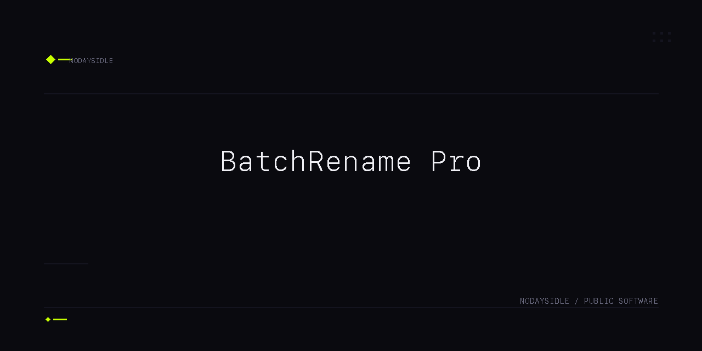

# BatchRename Pro

> Batch rename files safely in one local-first desktop app. No cloud. No scripts.


## Overview

BatchRename Pro handles file renaming operations through regex patterns, template tokens, and sequential numbering — with live preview, conflict blocking, backup, and full undo. Ships as a dark-mode Tauri desktop app.

## Features

- **Batch rename** — regex patterns, template tokens (`{date}`, `{number}`, `{original}`, `{ext}`), sequential numbering with zero-padding, case transforms
- **Live preview** — see results before anything touches disk
- **Conflict blocking** — detects name collisions before applying
- **Undo** — every operation creates a backup; full rollback from SQLite-backed job history
- **Drag-drop input** — drop files or folders directly
- **Accent themes** — blue and violet

Format conversion and metadata editing tabs are present in the UI but disabled until fully implemented.

## Technology

| Area | Technology |
|------|------------|
| Shell | Tauri 2 |
| Frontend | Vite 6, React 19, TypeScript, Tailwind CSS 4 |
| Backend | Rust 2021, Rayon (parallel processing) |
| Storage | SQLite via rusqlite (WAL mode), FTS5 |

## Requirements

- Node.js 20 or later
- Rust stable 1.75 or later
- Xcode CLI Tools (macOS)

## Installation

Download the latest macOS DMG from [GitHub Releases](https://github.com/nodaysidle/batchrename-pro/releases/tag/v0.1.0):

- `BatchRename-Pro-0.1.0-aarch64.dmg`
- SHA256: `ef6e33a03881430c329fd9fd888cf4010142598010a89b535cf0eb2c3948309b`

Open the DMG and drag `BatchRename Pro.app` to `/Applications`. The build is ad-hoc signed, not Apple-notarized. If macOS blocks first launch, right-click the app and choose **Open**.

## Development

```bash
git clone https://github.com/nodaysidle/batchrename-pro.git
cd batchrename-pro
npm install
npx tauri dev
```

Production build:

```bash
npm run build && npx tauri build
```

Release binary: `src-tauri/target/release/bundle/macos/BatchRename Pro.app`

## Architecture

```
┌─────────────────────────────────────────────────┐
│  WebView (React 19 + TypeScript + Tailwind CSS) │
│  DropZone │ FileList (virtualized) │ TransformPanel │
│                   ActionFooter                   │
└──────────────────┬──────────────────────────────┘
                   │ Tauri IPC
┌──────────────────┴──────────────────────────────┐
│  Rust Backend                                   │
│  Preview Service │ File Service │ Processing Pipeline (Rayon) │
│  SQLite (WAL)    │ Convert Service │ Metadata Service │
└─────────────────────────────────────────────────┘
```

## Status

v0.1.0 — Rename workflow complete. Format conversion and metadata editing tabs are disabled until fully implemented.

## Contributing

This repository is not currently accepting external contributions.

## License

MIT
